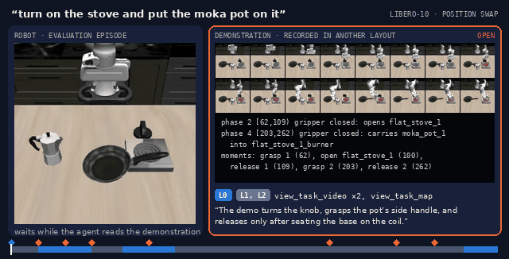

# RV-ICL on LIBERO

A runnable pipeline for **RV-ICL** ("Recursive Video In-Context Learning for Agentic Robot") on
LIBERO-PRO, built on [RPent / HarnessVLA](https://github.com/RLinf/RPent).

**[Project page](https://bwr-hhh.github.io/rvicl/)** with a replay of one episode, the demonstration hierarchy and the results.



One LIBERO-10 episode under position swap, replayed with the agent's tool calls. The robot (left, 2.5x speed) waits whenever the
agent opens the demonstration, and the clip it asked for plays on the right. The project page has the interactive version.

## What is in this repository

```
patches/rvicl-libero.patch   changes to RPent (robots/libero + two core files); applies to commit d6daf341
scripts/apply_patch.sh       clone RPent at the base commit and apply the patch
scripts/start_services.sh    start the shared Pi0.5 and SAM 3 servers
scripts/run_cell.sh          run one cell
scripts/run_sweep.py         run many cells with resume, retries and scoring from the simulator
scripts/fetch_memory.py      download the LIBERO memory corpus at the pinned revision
benchmark_patches/           task files for three LIBERO-PRO tasks, installed by benchmark_patches/install.py
```

## Planner API

Copy `.env.example` to `.env`, fill it in and `source` it before running:

| variable | meaning |
|---|---|
| `OPENAI_API_KEY`, `CODEX_API_KEY` | your key for the OpenAI-compatible endpoint (both are read; set them to the same value) |
| `OPENAI_BASE_URL`, `CODEX_BASE_URL` | the endpoint; leave unset for the official API, set to your relay or self-hosted gateway otherwise |
| `RVICL_PLANNER` | RPent planner backend: `codex` (OpenAI Codex SDK, what the pipeline was run with), `api` (OpenAI-style chat API) or `claude_code` (Anthropic; needs `ANTHROPIC_API_KEY` and, for a relay, `ANTHROPIC_BASE_URL`) |
| `RVICL_MODEL` | model name as your endpoint serves it (the pipeline was run with `gpt-6-astra`) |
| `RVICL_REASONING_EFFORT` | reasoning effort passed to the planner (`low` in the pipeline) |

`scripts/run_cell.sh` reads these variables; `scripts/run_sweep.py` takes the same values as
`--planner`, `--model` and `--reasoning-effort`.

## Setup

The workspace is a directory that holds this repository, the patched RPent checkout, the video
store and the run outputs side by side; every path can be overridden with the variables in
`.env.example` (`RVICL_ROOT`, `RPENT_DIR`, `RVICL_VIDEO_STORE`, `RVICL_MEMORY_DIR`).

```
workspace/
  rvicl/             this repository
  RPent/             upstream RPent at d6daf341 + patches/rvicl-libero.patch
  task_videos/       the per-task video store (40 videos)
  memory/libero/     the LIBERO memory corpus (scripts/fetch_memory.py)
  runs/              outputs
```

**1. RPent.** Python 3.11. Clone the upstream repository, check out the base commit, apply the
patch, install with the LIBERO-PRO extra and download the simulator assets (the
[RPent README](https://github.com/RLinf/RPent#quick-start) has the details and the other planners):

```bash
git clone https://github.com/BWR-hhh/rvicl.git
rvicl/scripts/apply_patch.sh RPent          # clone + checkout d6daf341 + git apply
cd RPent && python -m venv .venv && source .venv/bin/activate
pip install -e ".[libero-pro]"
liberopro-download-assets --skip-existing
```

Tested with `rpent-liberopro 0.2.0`, `robosuite 1.5.2`, `mujoco 3.3.0`, `torch 2.7.1+cu128`,
`openai-codex 0.154.0`. Without `--task-video-dir` the patched RPent behaves exactly like upstream.

**2. Checkpoints and keys.** Pi0.5 (`RLinf/RLinf-Pi05-LIBERO-130-fullshot-SFT`) and SAM 3 as in
the RPent README; export `PI05_CHECKPOINT_PATH`, `SAM3_CHECKPOINT_PATH` and `LIBERO_TYPE=pro`. The
planner credentials are the ones you set under **Planner API** above.

**3. Task files.** Three LIBERO-PRO tasks need replacement task files; install them once inside the
RPent environment:

```bash
python benchmark_patches/install.py
```

**4. The memory corpus.** RPent's LIBERO memory comes from the Hugging Face dataset
`RLinf/RPent-memory`, which was reorganised after these runs; fetch the pinned revision once:

```bash
python scripts/fetch_memory.py
```

**5. The video store.** Download the archive from the
[v0.1 release](https://github.com/BWR-hhh/rvicl/releases/tag/v0.1) and unpack it in the workspace
(one directory per base task, 40 in all), or point `RVICL_VIDEO_STORE` at wherever you put it:

```bash
cd <workspace>
curl -LO https://github.com/BWR-hhh/rvicl/releases/download/v0.1/task_videos_libero.tar.gz
curl -LO https://github.com/BWR-hhh/rvicl/releases/download/v0.1/task_videos_libero.tar.gz.sha256
sha256sum -c task_videos_libero.tar.gz.sha256 && tar -xzf task_videos_libero.tar.gz   # -> task_videos/
```

**6. Services.** One Pi0.5 server and one SAM 3 server are shared by every cell:

```bash
scripts/start_services.sh 0 8220 8114
export RPENT_VLA_ENDPOINT=http://127.0.0.1:8220 RPENT_SAM3_ENDPOINT=http://127.0.0.1:8114
```

Leave the two variables unset and every cell starts its own servers instead.

## Running

One cell (the RPent environment activated, the services running):

```bash
scripts/run_cell.sh libero_10_swap 4 1
scripts/run_cell.sh libero_10_task 2 1 --task-video-cross-task
```

The `*_task` suites rewrite the goal of every task (t2 demonstrates a moka pot where the suite asks
for a pan) and LIBERO-PRO ships no demonstrations of its own, so those suites get
`--task-video-cross-task`, which tells the planner the demonstration was recorded for the original
instruction. `run_sweep.py` adds it by itself.

A sweep (eight suites x ten tasks x seeds 1-3, resumable):

```bash
python scripts/run_sweep.py --suites all --tasks 0-9 --seeds 1-3 --gpu 0 --parallel 2
python scripts/run_sweep.py --suites libero_10_swap --tasks 4 --seeds 1 --dry-run   # print the commands
```

Rows go to `<out>/results.csv` (default `workspace/runs/sweep/`); a cell with a valid row is skipped
on the next start. A cell is solved when the run's `states.json` reports `terminated` (the
simulator's own flag). An attempt the provider rejected (quota, policy, a stream drop the SDK never
recovered from) is marked invalid and retried up to `--attempts` times; an episode itself is never
re-run. The summary table is printed at the end.

Defaults: `--max-turns 100`, `--planner-timeout-s 5000`, `--cell-timeout-s 7200`,
`--max-episode-steps 10000`, `--reasoning-effort low`. Seeds 1-3 only: seed 0 is the seed the
memory corpus was built on. Each cell in flight adds roughly 3 GB of host memory on top of
the shared services.

## Citation

```bibtex
@article{bao2026rvicl,
  title  = {Recursive Video In-Context Learning for Agentic Robot},
  author = {Bao, Wenrui and Liu, Xinxin and Xu, Bingxin and Shang, Yuzhang},
  year   = {2026},
}
```

This work builds on RPent / HarnessVLA:

```bibtex
@article{zhang2026harnessvla,
  title   = {Harness VLA: Steering Frozen VLAs into Reliable Manipulation Primitives via Memory-Guided Agents},
  author  = {Zhang, Yixian and Zhang, Huanming and Gao, Feng and Li, Xiao and Liu, Zhihao and Zhu, Chunyang and Qiu, Jiaxing and Yan, Yuchen and Liu, Jiyuan and Tang, Wenhao and Fang, Zhengru and Nie, Yi and others},
  journal = {arXiv preprint arXiv:2607.08448},
  year    = {2026}
}
```

The demonstrations come from [LIBERO](https://github.com/Lifelong-Robot-Learning/LIBERO); LIBERO-PRO
ships with RPent as `liberopro`.

## License

Apache License 2.0, the license of RPent, for the patch, the scripts and the prompt (`LICENSE`).
The demonstrations in the video store derive from the LIBERO datasets and keep their license.
